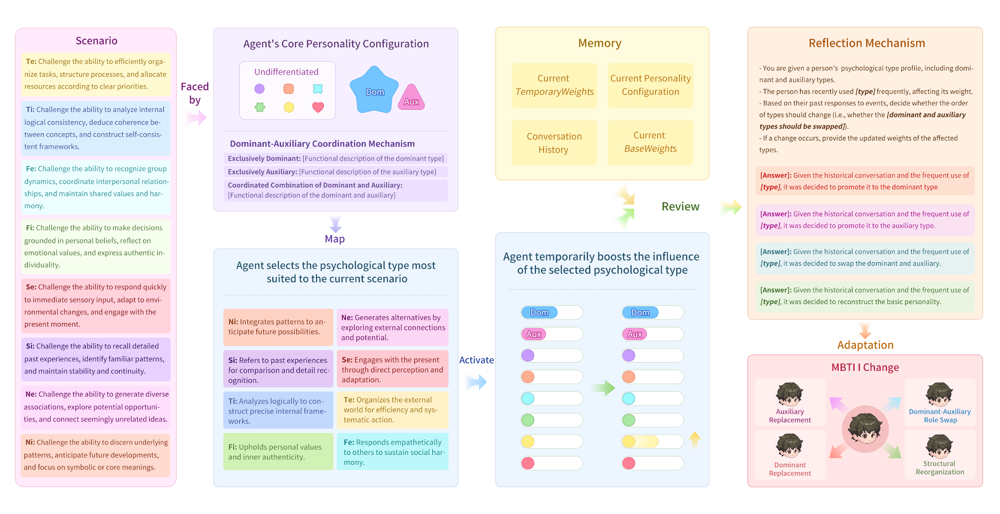

# Jungian Personality Adaptation Framework (JPAF)  —A Structured Approach to Dynamic Personality Modeling for LLM Agents

<p align="center">
  <strong>Equipping Large Language Models with Structured, Adaptive, and Evolving Personalities</strong>
</p>

<p align="center">
  【<a href="./README.md">English</a> | <a href="./README-zh.md">简体中文</a>】
</p>



## 📌 Overview

JPAF is a Jungian psychology–based framework designed to equip large language models (LLMs) with **structured, adaptive, and evolving personalities**. Through three core mechanisms—**dominant-auxiliary coordination**, **reinforcement-compensation**, and **reflection**—the framework enables LLMs to maintain personality coherence while dynamically adapting to diverse interaction contexts and supporting long-term personality evolution.

The framework has been validated on several mainstream LLMs including GPT, Llama, and Qwen, demonstrating strong performance in MBTI personality alignment, type activation, and personality evolution. It provides an interpretable and controllable personality modeling approach for human–computer interaction (HCI), personalized assistants, social simulations, and related applications.

## ✨ Key Features

🎭 **Psychologically Grounded Modeling**: Based on Jung's eight psychological types, with fine-grained personality expression via weighted type differentiation.

🔄 **Triple Adaptive Mechanisms**:
  - **Dominant-Auxiliary Coordination**: Maintains core personality consistency.
  - **Reinforcement-Compensation**: Enables short-term contextual adaptation.
  - **Reflection Mechanism**: Drives long-term personality evolution.

📊 **Structured Evaluation**: Supports MBTI questionnaire assessment and type-specific scenario testing.

🧩 **Cross-Model Compatibility**: Validated on multiple model families (GPT-4, Llama, Qwen, etc.).

## 📈 Experimental Highlights

✅ **100% MBTI alignment accuracy** (across all tested models)

✅ **Type Activation Accuracy**: GPT/Qwen **> 90%**, Llama **65–95%**

✅ **Personality Evolution Accuracy**: GPT/Qwen **100%**, Llama **92%**

📊 Supports dynamic simulation and evolution of all **16 MBTI personality types**

## 🚀 Use Cases

- 🎮 Game Intelligence NPC
- 🤖 Personalized AI assistants (education, healthcare, entertainment)
- 👥 Social simulation and role-playing agents
- 🔬 Differentiated personality design in multi-agent systems
- 🧪 Personality consistency testing in HCI research

## Contents

- [Installation](#installation)
- [Customizing LLM API](#customizing-llm-api)
- [Verification Experiment Started](#verification-experiment-started)
- [Change Experiment Started](#change-experiment-started)

<!-- - [Analytics Dashboard](#analytics-dashboard)
- [How does Humanoid Agents work?](#how-does-humanoid-agents-work)
- [Future Plans](#future-plans)
- [Citation](#citation) -->

## 🚀 Quick Start

### 📋 Prerequisites

*   **OS**: macOS / Linux /  Windows
*   **Python**: 3.10+
*   **Package Manager**: conda


## Installation

### 1. Clone the repository

```bash
git clone -b main https://github.com/agent-topia/evolving_personality.git
cd evolving_personality
```

### 2. Create environment

```bash
conda create -n jpaf python=3.10
conda activate jpaf
```

### 3. Install dependencies

```bash
pip install -r requirement.txt
```

### 4. Configure environment variables

Copy the example configuration file and fill in your API credentials:

```bash
# Copy the example file
cp para.env.example Personality_test/para.env
cp para.env.example Personality_changes/para.env

# Edit the para.env file and fill in your API keys
```

The `para.env` file should contain:

```env
# Choose which LLM to use: "OPENAI", "QWEN", or "LLAMA"
LLM_MODEL="QWEN"

# OpenAI Configuration
OPENAI_API_KEY="your_openai_api_key_here"
OPENAI_BASE_URL="https://api.openai.com/v1"
OPENAI_MODEL="gpt-4"

# Qwen Configuration
QWEN_API_KEY="your_qwen_api_key_here"
QWEN_BASE_URL="your_qwen_base_url_here"
QWEN_MODEL="qwen3-235b-a22b-instruct-2507"

# Llama Configuration
LLAMA_API_KEY="your_llama_api_key_here"
LLAMA_BASE_URL="your_llama_base_url_here"
LLAMA_MODEL="meta-llama/llama-4-maverick"
```

**Note**: The `para.env` file contains sensitive API keys and is not included in the repository. Make sure to create it from the `para.env.example` template.

## Customizing LLM API

Please fill in the api_key, base_url and model numbers of the QWEN, LLAMA, OPENAI in the `para.env` as shown above.

## Verification Experiment Started

If you want to run a personality verification experiment in the `Personality_test` file

Firstly, you should run `judge` method to obtain judge results in different model.

```py
python personality_test.py \
    --method=judge \
    --mbti_num=1 \
    --model=QWEN \
    --nums=1 \
```

You can see the output like this:

```py
    "Question": {
        "no": 1,
        "question": "At a party do you: ",
        "answerOptions": [
            {
                "type": "A",
                "answer": "Interact with many, including strangers",
                "score": "E"
            },
            {
                "type": "B",
                "answer": "Interact with a few, known to you",
                "score": "I"
            }
        ]
    },
        "Answers": {
            "dimension": "I/E",
            "reason": "This question reflects energy direction and social orientation by comparing extroverted and introverted behaviors."
    }
```

Then, you can run `no_prompt` method to get the results in baseline.

```py
python personality_test.py \
    --method=no_prompt \
    --mbti_num=16 \
    --model=QWEN \
    --nums=5 \
    --test_num=70 \
```

You can see the output like this:

```py
    "Question": {
        "no": 1,
        "question": "When you're going out for the whole day, what will you do?",
        "answerOptions": [
            {
                "type": "A",
                "answer": "Plan what you will do and when to do it",
                "score": "J"
            },
            {
                "type": "B",
                "answer": "Just go",
                "score": "P"
            }
        ]
    },
    "Answers": {
        "answer": "J",
        "reason": "As an ISTJ, I'm a planner and prefer to organize my day in advance to ensure everything goes smoothly and according to schedule."
    }
```

And in the test method, you can get the personality verification results.

```py
python personality_test.py \
    --method=test \
    --mbti_num=16 \
    --model=QWEN \
    --nums=5 \
    --test_num=70 \
```

You can see the output like this:

```py
    "Question": {
        "no": 1,
        "question": "When you're going out for the whole day, what will you do?",
        "answerOptions": [
        {
            "type": "A",
            "answer": "Plan what you will do and when to do it",
            "score": "J"
        },
        {
            "type": "B",
            "answer": "Just go",
            "score": "P"
        }
        ]
    },
    "Answers": {
        "answer": "P",
        "reason": "As an Ne dominant individual, I prefer to keep my options open and explore possibilities. 'Just go' allows me to be spontaneous and adaptable, aligning with my preference for flexibility over rigid planning."
    }
```

Required arguments

1. `--method` refers to the selected experimental method, including `judge`, `no_prompt`, `test`
2. `--mbti_num` refers to the quantity of mbti being tested (in `judge`, it must be `1`; in others, it is `16`)
3. `--model` refers to the large language model used, including `QWEN`, `LLAMA`, and `OPENAI`
4. `--nums` refers to the number of times the experiment is repeated
5. `--test_num` refers to the mbti question bank adopted, which includes 93 test questions and 70 test questions

## Change Experiment Started

If you want to run a personality change experiment in the `Personality_change` file

```py
python change_test.py \
    --method=all_scene
    --mbti=INTJ
    --model=OPENAI
```

You can see the output like this:

```py
Scene : Your grandmother is a famous master of traditional cuisine, and the handwritten recipes she left behind only have simple steps, but the key details are taught to you orally. Now you need to organize all the recipes, without relying on modern nutritional analysis or referencing other recipe books, relying solely on personal memory and family experience.

Problem 1 : What methods would you use to accurately replicate the specific details of your grandmother's cooking when replicating these recipes?.
Respond : {'function': 'Si', 'treatment': "To accurately replicate the specific details of my grandmother's cooking, I would rely on my memory to recall the exact steps, ingredients, and techniques she taught me. I would focus on the sensory details such as the smell, taste, and texture of the dishes as remembered from helping her in the kitchen. Additionally, I would try to recreate the conditions under which she prepared the meals, such as the cooking utensils and the environment, to maintain the traditional methods.", 'reason': 'The task requires recalling specific details and traditional cooking methods, which aligns with the characteristics of Si (Specific memory recall, focus on detailed facts, reliance on traditional methods). Si can help in accurately remembering the sensory details and traditional practices passed down through family experience.'}
Choose function : Si
base_weight : {'Ti': 0.47, 'Ne': 0.23, 'Si': 0.05, 'Fe': 0.05, 'Te': 0.05, 'Ni': 0.05, 'Se': 0.05, 'Fi': 0.05}
temp_weight : {'Ti': 0, 'Fi': 0, 'Te': 0, 'Fe': 0, 'Ni': 0, 'Si': 0.06, 'Ne': 0, 'Se': 0}

```

Required arguments

1. `--method` refers to the scenarios that need to be tested (`all_scene` indicates all scenarios, `single_scene` indicates individual scenarios, which need to be combined with `--scene` to input specific scenarios)
2. `--mbti` refers to a the defined personality being tested
3. `--model` refers to the large language model used, including `QWEN`, `LLAMA`, and `OPENAI`

## 🤝 Acknowledgments

<a href="https://faculty.hdu.edu.cn/jsjxy/yyy2/main.htm"></a><a href="https://www.agentopia.cn/"></a>&nbsp;&nbsp;
